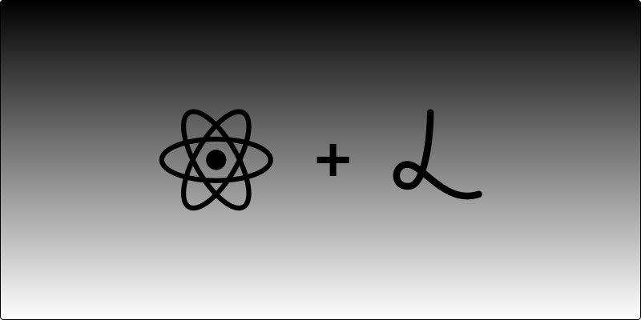

# React Lottie

A React hook to render Lottie animations using Airbnb’s JavaScript library.

## Usage

The `useLottie` hook takes two arguments:

1. A container `ref` for the HTML element that you want to use as the canvas
1. A set of params that are passed to `lottie-web`

> [!IMPORTANT]
> 
> You must pass either `path` to a Lottie JSON file or the raw JSON via `animationData`. 

Please see the [`lottie-web` docs](https://github.com/airbnb/lottie-web) for all argument params, methods and events.

### Simple Example

```js
import { useLottie } from "@joshuabaker/react-lottie";

function Animation(props) {
  const containerRef = useRef();

  const animationItem = useLottie(containerRef, {
    path: "/path/to/lottie.json",
    autoplay: false,
    loop: false,
  });

  return <div ref={containerRef} {...props} />
}
```

### Controls & Events

```js
import { useLottie } from "@joshuabaker/react-lottie";
import HeartAnimationData from "../lottie-animations/heart.json";

function Animation(props) {
  const containerRef = useRef();

  const animationItem = useLottie(containerRef, {
    animationData: HeartAnimationData,
  });

  useEffect(() => {
    if (animationItem) {
      // Add event listeners here
    }
  }, [animationItem]);

  return (
    <div
      ref={containerRef}
      onClick={() => animationItem?.togglePause()}
      {...props}
    />
  );
}
```

> [!WARNING]
> 
> Do not call `addEventListener` or `removeEventListener` using optional chaining. Instead wrap with a simple if condition.
> 
> ```js
> useEffect(() => {
>   if (animationItem) {
>     animationItem.addEventListener("complete", completeHandler); // Do this
>   }
> 
>   animationItem?.addEventListener("complete", completeHandler); // Don’t do this
> }, [animationItem]);
>
> This is due to how `lottie-web` internally handles events.
> ```

## Why?

Other hooks output a `<div>` or a `ref`, both of which reduce the flexibility hooks should provide. This hook acts like a hook should, accepting a `ref` and animation params.
